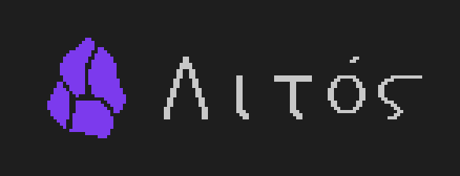
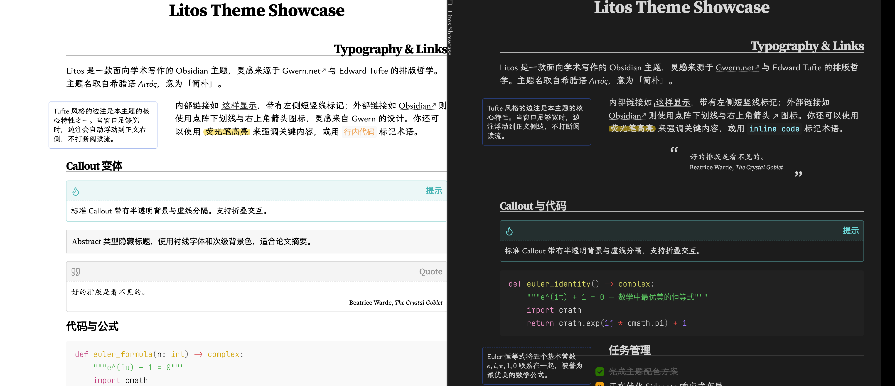

# Litos



An Obsidian theme with academic aesthetics, Tufte-style sidenotes, and CJK font support.



## Features

- Clean, academic-inspired typography
- Tufte-style sidenotes via container queries
- Light and dark mode with HSL accent color system
- CJK (Chinese/Japanese/Korean) font support
- Custom callout variants (revert, blank-container, multi-column)
- Styled checkboxes, tables, and Mermaid diagrams
- Minimal UI (status bar, ribbons, tabs)

## Installation

### From Community Themes

1. Open **Settings → Appearance → Themes**
2. Click **Manage** and search for **Litos**
3. Click **Install and use**

### Manual

```bash
git clone https://github.com/zerokei/Litos \
  <vault>/.obsidian/themes/Litos
```

Then enable in **Settings → Appearance → Themes → Litos**.

## Recommended Fonts

This theme is designed with the following font stack. Install them for the best experience:

| Purpose | Font |
|---------|------|
| Text | [LXGW Bright](https://github.com/lxgw/LxgwBright) |
| Monospace | [JetBrains Mono](https://github.com/JetBrains/JetBrainsMono) |
| Accent / Quotes | [Source Serif 4](https://fonts.google.com/specimen/Source+Serif+4) |
| CJK Serif | [Source Han Serif SC](https://github.com/adobe-fonts/source-han-serif) |
| Fallback Mono | [Courier Prime](https://fonts.google.com/specimen/Courier+Prime) |

## Credits

Inspired by:

- [Obsidian-Serenity](https://github.com/Bluemoondragon07/Obsidian-Serenity)
- [Gwern.net](https://gwern.net/about)
- [obsidian-sidenote-auto-adjust-module](https://github.com/crnkv/obsidian-sidenote-auto-adjust-module)

## License

[MIT](LICENSE)
