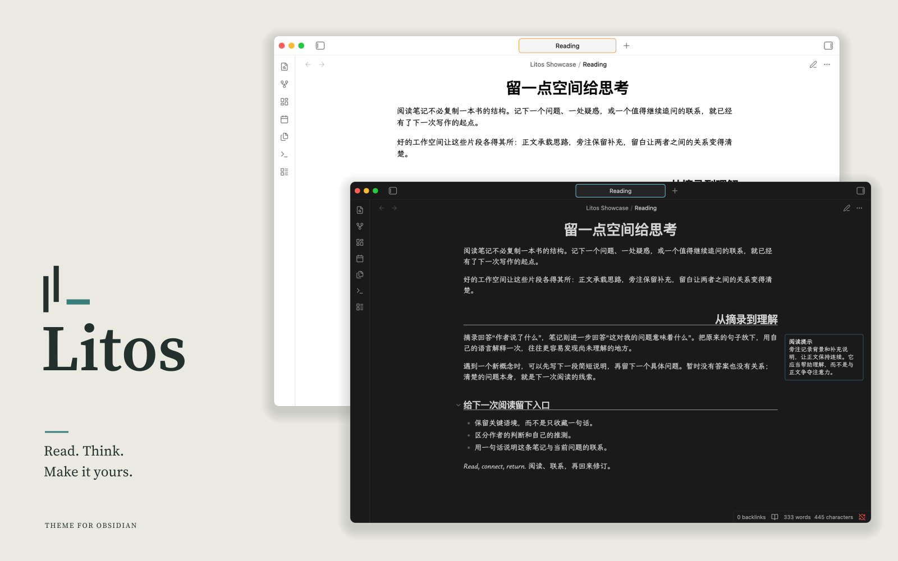

A considered workspace for Obsidian, with editorial typography, clear controls, and room to make it your own.

[View the showcase](docs/showcase.md) · [Optional companion plugin](https://github.com/Zerokei/Litos-Companion)

## Features

- **Typography**: Serif headings and CJK font support for reading and writing.
- **Sidenotes**: Keep supporting information beside the main text when space allows.
- **Workspace**: Centered document tabs and consistent controls across the interface.
- **Appearance**: Light and dark modes with customizable accent colors.
- **Note elements**: Styled callouts, checkboxes, tables, and Mermaid diagrams.

Litos works on its own. [Litos Companion](https://github.com/Zerokei/Litos-Companion) adds heading alignment, Zen mode, an accent color entry, and optional Mermaid ELK rendering.

## Installation

Requires Obsidian **1.13.7 or later**.

### From Community Themes

1. Open **Settings → Appearance → Themes**
2. Click **Manage** and search for **Litos**
3. Click **Install and use**

### Manual

```bash
git clone https://github.com/zerokei/Litos \
  <vault>/.obsidian/themes/Litos
```

Then enable in **Settings → Appearance → Themes → Litos**.

## Recommended Fonts

This theme is designed with the following font stack. Install them for the best experience:

| Purpose | Font |
|---------|------|
| Text | [LXGW Bright](https://github.com/lxgw/LxgwBright) |
| Monospace | [JetBrains Mono](https://github.com/JetBrains/JetBrainsMono) |
| Accent / Quotes | [Source Serif 4](https://fonts.google.com/specimen/Source+Serif+4) |
| CJK Serif | [Source Han Serif SC](https://github.com/adobe-fonts/source-han-serif) |
| Fallback Mono | [Courier Prime](https://fonts.google.com/specimen/Courier+Prime) |

## Recommended Settings

For the theme to look its best, adjust these under **Settings → Appearance**:

| Setting | Value | Why |
|---------|-------|-----|
| Translucent window | **Off** | When on, the title bar uses a semi-transparent black that clashes with the theme background. |
| Readable line length | **On** | Gives Tufte-style sidenotes room to sit fully in the margin; with it off they fall back to a narrower, intrusive layout. |

## Credits

Inspired by:

- [Obsidian-Serenity](https://github.com/Bluemoondragon07/Obsidian-Serenity)
- [Gwern.net](https://gwern.net/about)
- [obsidian-sidenote-auto-adjust-module](https://github.com/crnkv/obsidian-sidenote-auto-adjust-module)

## License

[MIT](LICENSE)
