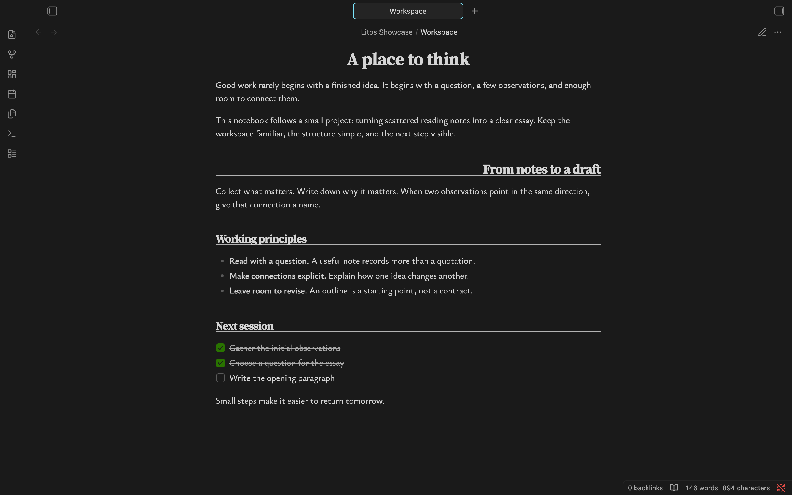
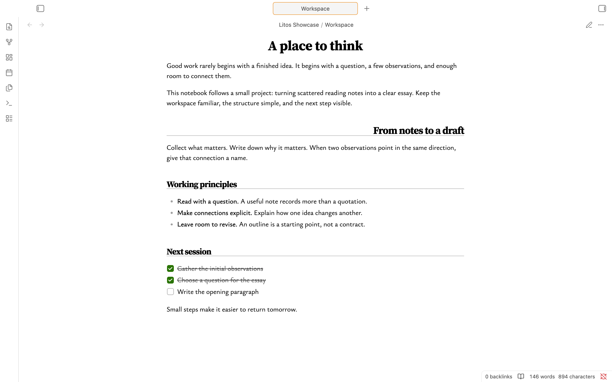
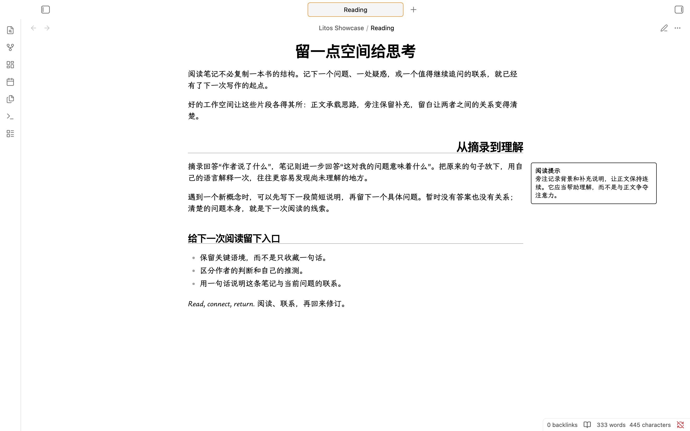
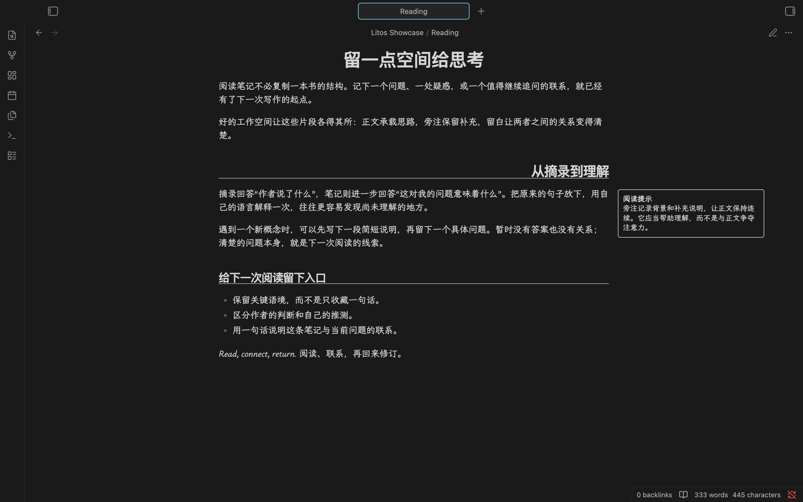
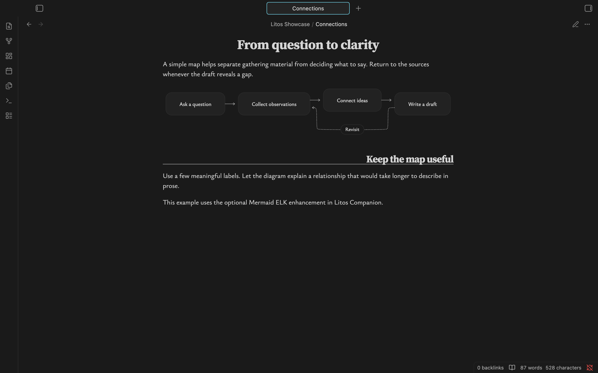

# Litos showcase

A workspace for reading, writing, and connecting ideas. These examples use ordinary notes in Obsidian, with no screenshot-only styling.

## One workspace, two appearances

The same writing note, shown at the same position and viewport size. Workspace controls remain visible.

## Space for a second thought

Chinese text and a sidenote in Reading view. On a wide workspace, supporting information sits beside the text rather than interrupting it.

## Extend with Litos Companion

The optional plugin adds ELK layout to Mermaid flowcharts. This example shows a return path alongside a short sequence of steps.

## Try the notes

Copy the [example notes](../examples/brand/) into your vault. Diagram enhancement must be enabled in Companion for the enhanced flowchart. Fonts, accent colors, window width, and other settings can change the appearance.

[Back to Litos](../README.md)
