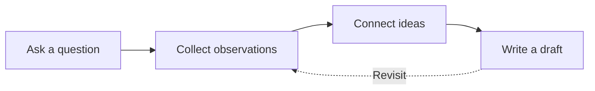

# From question to clarity

A simple map helps separate gathering material from deciding what to say. Return to the sources whenever the draft reveals a gap.

## Keep the map useful

Use a few meaningful labels. Let the diagram explain a relationship that would take longer to describe in prose.

This example uses the optional Mermaid ELK enhancement in Litos Companion.
